 

---

# 👋 About Me

<table>
<tr>

<td width="62%" valign="middle">

<h2>Hi, I'm Ankit Choudhary 👋</h2>

🎓 <b>Computer Science Student</b>
&nbsp; • &nbsp;
💻 <b>Developer</b>

🧠 <b>DSA Enthusiast</b>
&nbsp; • &nbsp;
🚀 <b>Project Builder</b>

 

I enjoy solving problems, building real-world applications,
and continuously improving my development skills.

 

</td>

<td width="38%" align="center">

  

</td>

</tr>
</table>

 

<table>
<tr>

<td align="center" width="33%">

<h2>🧠</h2>

<h3>Data Structures</h3>

Arrays • Strings 
Linked Lists • Trees 
Algorithms • Problem Solving

</td>

<td align="center" width="33%">

<h2>💻</h2>

<h3>Development</h3>

Frontend • Backend 
APIs • Databases 
Full Stack

</td>

<td align="center" width="33%">

<h2>🚀</h2>

<h3>Current Mission</h3>

Master DSA 
Build Real-World Applications

</td>

</tr>
</table>

 

---

# 💻 Developer Profile

<table>
<tr>

<td width="50%" valign="top">

### 🎯 Current Focus

  

- 🧠 Data Structures & Algorithms
- 💻 C++ Problem Solving
- 🌐 Full Stack Development
- 🚀 Real-World Applications
- 📚 Continuous Learning

</td>

<td width="50%" valign="top">

### 💡 Philosophy

 

  

</td>

</tr>
</table>

---

# ⚡ What I Do

<table>
<tr>

<td align="center" width="33%">

<h1>🧠</h1>

<h3>DSA & Problem Solving</h3>

Algorithms 
Data Structures 
Competitive Problem Solving 
LeetCode

</td>

<td align="center" width="33%">

<h1>💻</h1>

<h3>Web Development</h3>

Frontend 
Backend 
REST APIs 
Database Integration

</td>

<td align="center" width="33%">

<h1>🚀</h1>

<h3>Project Building</h3>

Real World Applications 
SaaS Ideas 
Experiments 
Deployment

</td>

</tr>
</table>

---

# 📊 System Status

<table>
<tr>

<td align="center" width="16%">

<h2>🧠</h2>
<b>DSA</b>
 

</td>

<td align="center" width="16%">

<h2>💻</h2>
<b>Development</b>
 

</td>

<td align="center" width="16%">

<h2>🚀</h2>
<b>Projects</b>
 

</td>

<td align="center" width="16%">

<h2>📚</h2>
<b>Learning</b>
 

</td>

<td align="center" width="16%">

<h2>🐛</h2>
<b>Bugs</b>
 

</td>

<td align="center" width="16%">

<h2>☕</h2>
<b>Coffee</b>
 

</td>

</tr>
</table>

 

---

# 🛠️ Tech Stack

### 👨‍💻 Languages

  

### 🎨 Frontend

  

### ⚙️ Backend & Database

  

### 🔧 Tools & Platforms

# 🟠 LeetCode

  

<table>
<tr>

<td align="center" width="25%">

<h2>🧩</h2>

<b>PROBLEM</b>

 

Solving

</td>

<td align="center" width="25%">

<h2>💡</h2>

<b>APPROACH</b>

 

Think

</td>

<td align="center" width="25%">

<h2>⚡</h2>

<b>OPTIMIZE</b>

 

Improve

</td>

<td align="center" width="25%">

<h2>🚀</h2>

<b>SYNC</b>

 

GitHub

</td>

</tr>
</table>

 

  

<b>My LeetCode solutions are automatically synced to GitHub.</b>

---

 
# 📈 GitHub Analytics

<table>
<tr>

<td width="50%">

</td>

<td width="50%">

</td>

</tr>
</table>

 

---

---

 
# 📊 Contribution Activity

---

 

# 🐍 Contribution Snake

---

# 🚀 Featured Projects

<table>
<tr>

<!-- ECOTRACK LITE -->

<td width="50%" valign="top">

<h2 align="center">🌱 EcoTrack Lite</h2>

<b>AI-Powered Sustainability Platform</b>

Track carbon footprint, build eco-friendly habits,
complete goals, earn badges and compete on leaderboards.

  

  

&nbsp;

</td>

<!-- SHADOWVAULT -->

<td width="50%" valign="top">

<h2 align="center">🛡️ ShadowVault</h2>

<b>Secure Digital Marketplace</b>

Modern digital marketplace with payments,
authentication, 2FA, admin controls and premium UI.

  

  

</td>

</tr>

<tr>

<!-- NOVAVOICE -->

<td width="50%" valign="top">

<h2 align="center">🤖 NovaVoice AI</h2>

<b>Real-Time AI Voice Assistant</b>

AI voice assistant powered by Gemini Live API
with real-time communication and Google Calendar integration.

  

  

</td>

<!-- LEETCODE -->

<td width="50%" valign="top">

<h2 align="center">🧠 LeetCode Solutions</h2>

<b>Data Structures & Algorithms</b>

My DSA journey with solutions automatically
synced from LeetCode to GitHub.

  

  

</td>

</tr>

</table>

 

---

# 🎯 2026 Goals

<table>
<tr>

<td width="50%" valign="top">

### 🧠 Learning

- ✅ Improve C++
- ✅ Practice Arrays & Strings
- 🔄 Master Advanced DSA
- 🔄 Solve More LeetCode Problems
- ⏳ Learn Advanced Algorithms

</td>

<td width="50%" valign="top">

### 🚀 Building

- 🔄 Production-Level Projects
- 🔄 Full Stack Applications
- ⏳ Open Source Contributions
- ⏳ Advanced SaaS Projects
- ⏳ Build Something Impactful

</td>

</tr>
</table>

---

# 💻 Developer Dashboard

<table>
<tr>

<td align="center" width="25%">

<h2>🧠</h2>

<b>DSA</b>

 

</td>

<td align="center" width="25%">

<h2>🌐</h2>

<b>WEB</b>

 

</td>

<td align="center" width="25%">

<h2>🚀</h2>

<b>PROJECTS</b>

 

</td>

<td align="center" width="25%">

<h2>📚</h2>

<b>LEARNING</b>

 

</td>

</tr>
</table>

 

---

# 📬 Connect With Me

&nbsp;

&nbsp;

---

 

 

⭐ <b>Thanks for visiting my profile!</b>

